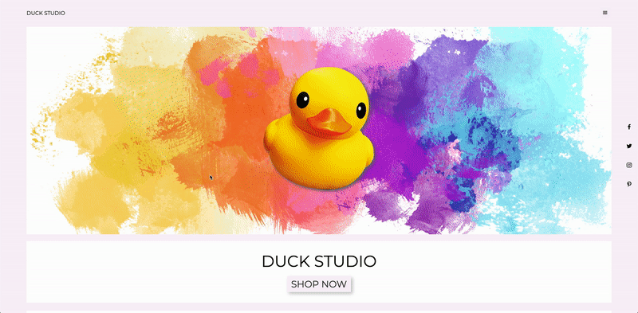

# Duck Studio

**Online store where you can get cute little rubber ducks.**

Duck Studio is an e-commerce website that offers cute little rubber ducks for sale. Website visitors can sign-up, login and start shopping. Checkout is available with Stripe payment system. Created using responsive design. Written in JavaScript/React on frontend and Ruby on Rails on a backend. Deployed on Heroku/Firebase.

**Demo:** [YouTube](https://youtu.be/MclkO367ARY)

**Stack:**
> - Ruby on Rails;
> - JavaScript;
> - React;
> - HTML/CSS;
> - Docker;
> - Stripe.

**API:**
> - [Stripe](https://stripe.com/docs/api)

**How to run instructions:**
1. Fork and clone this Project's GitHub repository.  
2. Have current version of Ruby, Rails and Node installed.
3. Open a terminal and navigate into the backend folder:
* _Install required gems (listed in Gemfile) by running the command 'bundle install';_
* _Run the command 'rails db:create' which will create the database;_
* _Run the command 'rails db:migrate' which will do DB migrations;_
* _Run the command 'rails db:seed' which will populate the database with existing user/plan/lists/tasks data;_
* _Run the command 'rails s' to start backend server;_
4. Open a separate terminal window/tab and navigate into the frontend folder:
* _Run the command 'npm install' to install dependencies into the node_modules/ directory;_
* _Run the command 'npm start' to start frontend server._

**Future features:**
- [ ] unit tests;
- [ ] suggested items;
- [ ] favorite items;
- [ ] user profile;
- [ ] email auto-response;
- [ ] purchase history;
- [ ] cart/checkout cleanup;
- [ ] admin account.

**Duck Studio is an online store integrated with Stripe (test mode ON) and was created for educational purposes only.**
**Created by Tatiana Smolin as part of a MOD3 Solo Project at Flatiron School.**
